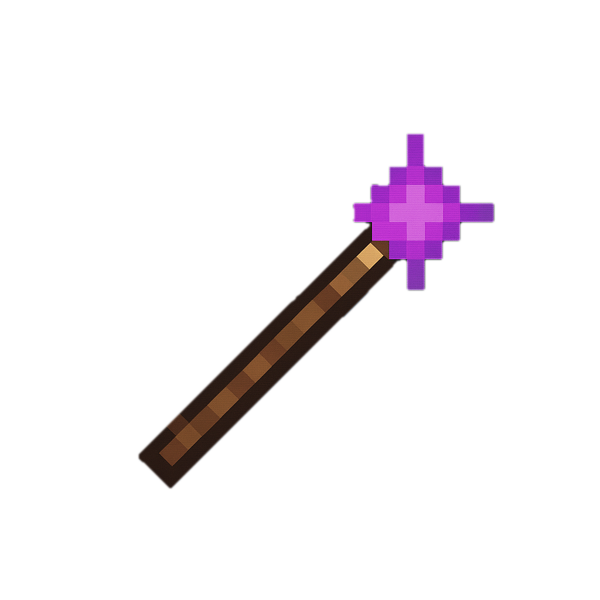
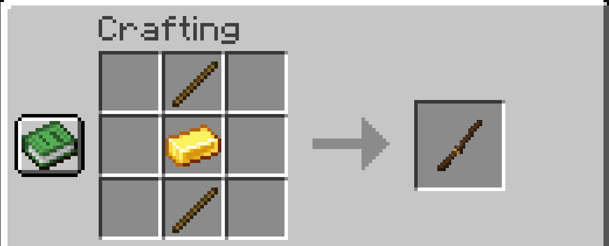

<h1 align="center">
	Mine Arena
</h1>

A Forge mod built for Minecraft Java 1.21.1 that makes for voice controlled spell casting (like in Mage Arena) and additionally allows for the creation for custom spells using natural language prompt.

  <h1>Demo Video</h1>
  

## 📋 Requirements

### Essential
- **Minecraft Java Edition 1.21.1** with Forge installed
- **Compatible Web Browser** with Speech Recognition API support:
  - ✅ Google Chrome (recommended)
  - ✅ Microsoft Edge
  - ✅ Safari
  - ❌ Firefox (not supported)

### Optional (For Creating Custom Spells)
- **<a href="https://openrouter.ai/">OpenRouter Account</a>** - Free to create, and free to use as long as you use the free models under this <a href="https://openrouter.ai/models?max_price=0">list</a>.
- **<a href="https://www.meshy.ai/">Meshy AI Subscription</a>** - Paid subscription required for 3D model generation API access

<strong>Note:</strong> The mod comes with 5 default spells that work immediately without any API keys. You only need OpenRouter and Meshy accounts if you want to create your own custom spells.

## ✨ Core Features

### 🎤 Voice-Controlled Spell Casting
Voice recognition automatically activates when you join a world by opening up a new prompt on the supported browsers and requesting permission to use your microphone.

### 🔮 Default Spells
The mod includes five ready-to-use spells (no API keys required):
- **Infernal Blast** (say "Fireball") - Explosive fireball with area damage and ignite effect
- **Gale Force** (say "Wind") - Wind blast that knocks back enemies
- **Glacial Prison** (say "Ice cube") - Ice burst that freezes targets and places ice blocks
- **Arcane Detonation** (say "Bomb") - High-speed explosive bomb with block destruction
- **Ethereal Ascension** (say "Levitate") - Self-cast levitation spell

### 🧙 AI-Powered Custom Spell Creation
Create your own custom spells with natural language:
1. Right-click with the **Wand** item (craftable in-game)
2. Describe your spell idea (e.g., "A lightning bolt that stuns enemies")
3. Set a cast phrase to cast it (e.g., "Thunder Strike")
4. The AI generates the spell's behavior, effects, and visual appearance
5. Cast it by speaking your custom phrase!

<h2>How to Install/Compile</h2>

To install this mod, simply copy the <code>mine_arena-1.0.0.jar</code> file into the mods folder of your Minecraft directory.

If you would like to compile the .jar file yourself, navigate to the root directory of the project and run <code>gradlew build</code> from the command line.

<h2>Optional Custom Spell Setup & Configuration</h2>

<strong>Note:</strong> This is not needed for Default spells to work, only for custom spells.

<h3>Required API Keys</h3>

To use the AI spell creation features, you'll need API keys from two services:

<h4>1. OpenRouter API Key</h4>
<ul>
    <li>Sign up at <a href="https://openrouter.ai/">OpenRouter</a></li>
    <li>Copy your API key</li>
    <li>Open <code>config/mine_arena-common.toml</code> in your Minecraft directory</li>
    <li>Paste your OpenRouter API key in the config file</li>
</ul>
<h4>2. OpenRouter Model ID</h4>
<ul>
    <li>Find a free model in <a href="https://openrouter.ai/models?max_price=0"">OpenRouter</a></li>
    <li>Copy model id</li>
    <li>Open <code>config/mine_arena-common.toml</code> in your Minecraft directory</li>
    <li>Paste your OpenRouter model id in the config file</li>
</ul>
<h4>2. Meshy AI API Key</h4>
<ul>
    <li>Create an account at <a href="https://www.meshy.ai/settings/api">Meshy API Page</a></li>
    <li>Purchase a subscription to get API access</li>
    <li>Copy your API key</li>
    <li>Paste your Meshy API key in <code>config/mine_arena-common.toml</code></li>
</ul>

<h4>Example Configuration</h4>

<pre>
#OpenRouter API Key
openrouterApiKey = "sk-or-*****"
#OpenRouter model name for chat
openrouterModel = "deepseek/deepseek-chat-v3.1:free"
#Meshy API Key
meshyApiKey = "msy_****"
</pre>

<h2>Examples of Custom Spell Prompts</h2>

Here are some ideas for custom spells you can create:

<ul>
    <li><strong>"A healing aura around me"</strong>
    <li><strong>"Summon wolves to fight for me"</strong> 
    <li><strong>"A meteor that destroys terrain"</strong>
    <li><strong>"Poison gas cloud"</strong>
</ul>

<h2><strong>Wand Crafting Recipe:</strong></h2>
 </img>

<h2>Troubleshooting</h2>

<h3>Voice Recognition Not Working</h3>
<ul>
    <li>Make sure the browser tab that opens stays open in the background</li>
    <li>Check that your browser has microphone permissions</li>
    <li>Try using Chrome or Edge (best compatibility)</li>
    <li>Speak clearly and use simple, distinct cast phrases</li>
</ul>

<h3>Spell Generation Fails</h3>
<ul>
    <li>Verify both API keys are correctly set in <code>config/mine_arena-common.toml</code></li>
    <li>Check that you have credits in your OpenRouter and Meshy accounts</li>
    <li>Try simplifying your spell description</li>
    <li>Wait a moment and try again (API rate limits may apply)</li>
</ul>

<h3>Spells Not Casting</h3>
<ul>
    <li>Make sure voice recognition is active (browser tab open)</li>
    <li>Check that your spell has been successfully created (open the Wand interface to see your spell list)</li>
    <li>Try speaking the cast phrase more clearly or slowly</li>
    <li>Verify the cast phrase doesn't conflict with other spells</li>
</ul>

<h2>License</h2>

This project is open source. Feel free to modify and use it for your own projects.
