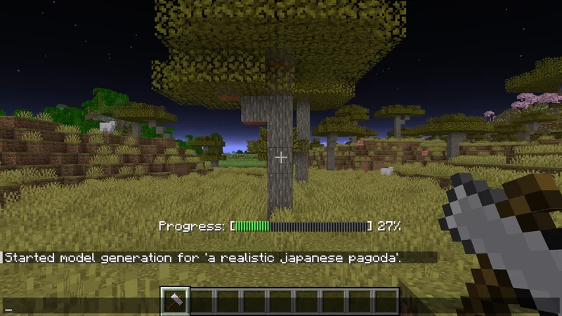
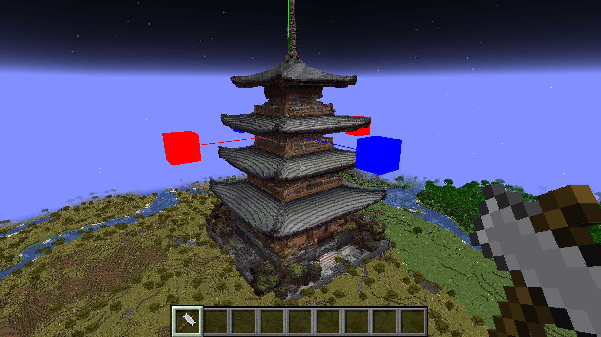
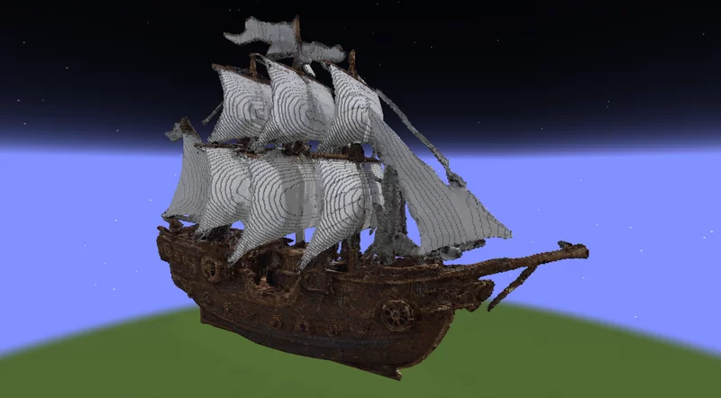
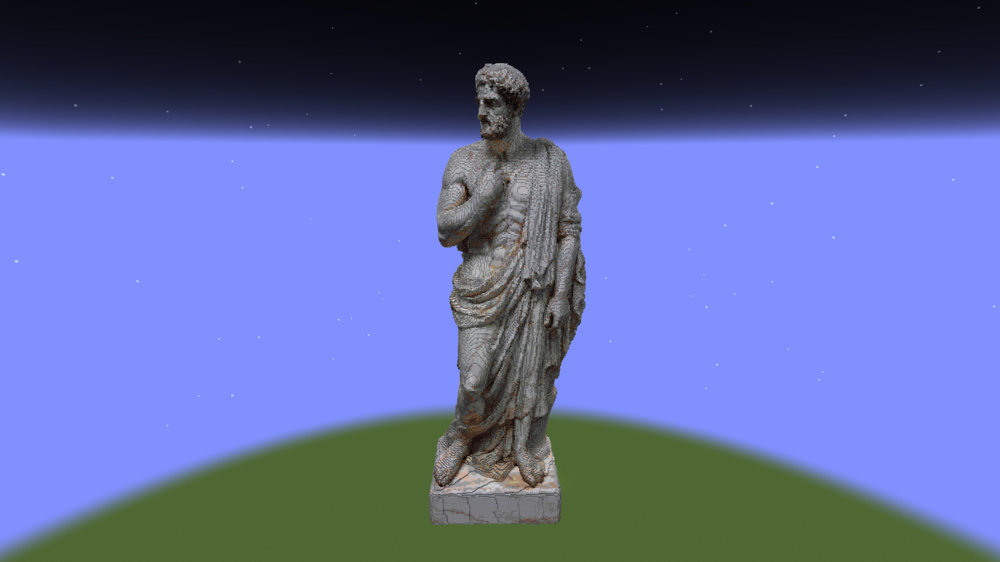
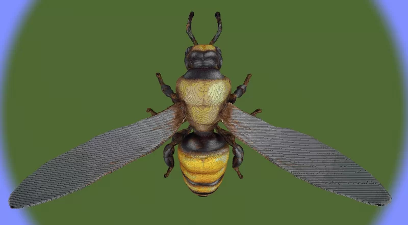
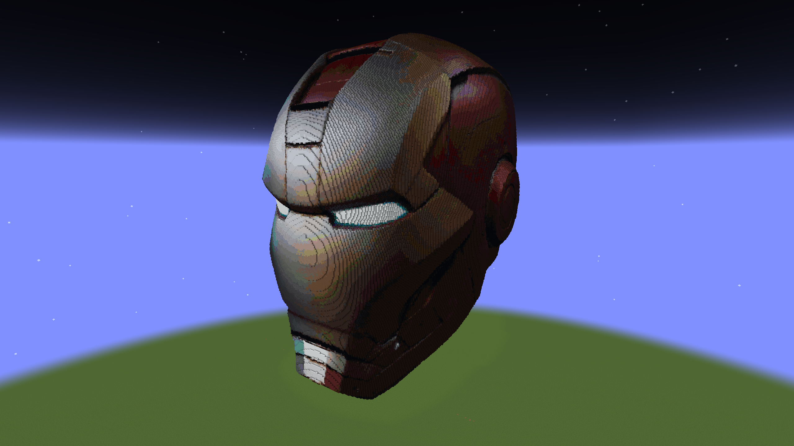

<h1 align="center">
	Mine Arena
</h1>

A Forge mod built for Minecraft Java 1.21.1 that allows you to build anything in Minecraft using the power of AI. The AI uses a text prompt to generate a 3D model of your idea, which you can then place into your Minecraft world. Alternatively, you can import your own 3D model files.

Models are automatically converted into a voxelized, blocky representations complete with textures and color matching. Players can scale, rotate, and position models in-game using intuitive keyboard and mouse controls, or through commands for more fine-tuned adjustments. 

This mod supports .obj file format, and provides a real-time preview of the model as it is transformed and placed within the world.

## Demo

Below are screenshots demonstrating AI model generation and placement in Minecraft.

### Generation in Progress

### Generation Result

## The builds below were all generated using this mod:

### Steampunk Airship

### Greek Statue

### Bee

### Iron Man Helmet

<h2>How to Install/Compile</h2>

To install this mod, simply copy the <code>mine_arena-1.0.0.jar</code> file into the mods folder of your Minecraft directory.

If you would like to compile the .jar file yourself, navigate to the root directory of the project and run <code>gradlew build</code> from the command line.

<h2>How to Use</h2>
<h3>Loading a Model</h3>

Upon launching the game, a <code>models</code> folder will be created in your Minecraft directory. Place your 3D models and textures in this folder.

To load a model in-game:

<ol>
    <li>Open your world.</li>
    <li>Run the command: <code>/model load &lt;filename&gt;</code>. The mod will list all valid filenames in your <code>models</code> folder.</li>
</ol>

<h3>Generating a Model</h3>
<ol>
    <li>To generate models using AI, an API key from Meshy is required. This involves creating an account on their website, and purchasing a subscription to get access to their API. This can be done here: <a href="https://www.meshy.ai/settings/api">Meshy API Page</a></li>
    <li>After acquiring an API key, go into the config folder of your Minecraft directory, and open "mine_arena-common.toml". Paste your API key here.</li>
    <li>Once you load up your world, run the command <code>model generate &lt;prompt&gt;</code> to generate a model.
</ol>

<h3>Model Commands</h3>

The <code>/model</code> command offers several subcommands for loading and working with 3D models.

<h4><code>/model load &lt;filename&gt;</code></h4>

Loads a model from the <code>models</code> folder. Supported format: <code>.obj</code>.

<h4><code>/model generate...</code></h4>
<ul>
	<li><code>/model generate &lt;prompt&gt; [&lt;model_name&gt;]</code>: Generates a 3D model from the given text prompt. If a model name is specified, will save the 3D model and textures to files using that name.</li>
	<li><code>/model generate cancel</code>: Cancels the current model generation if it exists. Useful for if generation is taking a long time or not responding.</li>
</ul>

<h4><code>/model place</code></h4>

Places the currently loaded model as blocks in the world at the player's position.

<h4><code>/model entity [&lt;microScale&gt;]</code></h4>

Spawns the currently loaded model as an entity at the player's position. The optional microScale parameter (0.001-1.0) controls the size of the entity (default: 0.0625).

<h4><code>/model entity_one</code></h4>

Spawns a simple single-block entity for testing purposes.

<h3>Changing Model Appearance</h3>

There are three possible rendering previews that can be switched between by pressing <strong>V</strong>.

<ul>
    <li><strong>Bounding Box</strong> (Default) [Low Performance Impact]</li>
    <li><strong>Mesh/Wireframe</strong> [Medium Performance Impact]</li>
    <li><strong>BLocks Preview</strong> [High Performance Impact]</li>
</ul>